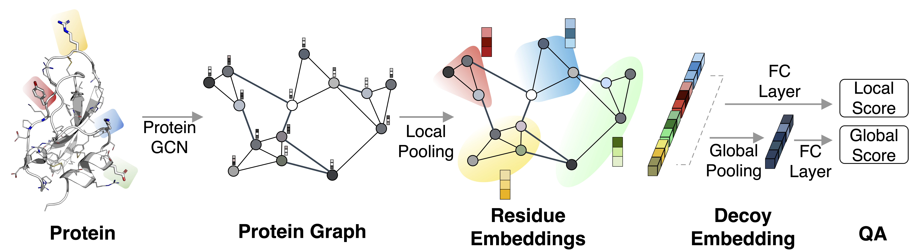

## ProteinGCN: Protein model quality assessment using Graph Convolutional Networks
 

Source code for the paper: **[ProteinGCN: Protein model quality assessment using Graph Convolutional Networks](https://www.biorxiv.org/content/10.1101/2020.04.06.028266v1)**



**Overview of ProteinGCN:** *Given a protein structure, it first generates a protein graph and uses GCN to learn the atom embeddings. Then, it pools the atom embeddings to generate residue-level embeddings. The residue embeddings are passed through a non-linear fully connected layer to predict the local scores. Further, the residue embeddings are pooled to generate a global protein embedding. Similar to residue embeddings, this is used to predict the global score.*

### Dependencies

- Compatible with PyTorch 1.0 and Python 3.x.
- Dependencies can be installed using the `requirements.txt` file.

### Dataset:

- We use Rosetta-300k to train the ProteinGCN model and test it on both Rosetta-300k and [CASP13](http://predictioncenter.org/download_area/CASP13/server_predictions/) dataset for local(residue) and global Quality Assessment predictions.

### Training model:

- Install all the requirements by executing `pip install -r requirements.txt.`

- Install required protein `.pdb` processing library by executing `sh preprocess.sh` which clones and installs [this](https://github.com/gjoni/mylddt) github repository.

- Next execute `python preprocess_pdb_to_pkl.py` script which creates the required `.pkl` files from the dataset to be used for model training. It defaults to a sample dataset provided with the code at `./data/`. To use the original datasets, please change the paths accordingly.

- To start a training run:
  ```shell
  python train.py trial_run --epochs 10
  ```
  Once successfully run, this creates a folder by the name `trial_run` under the path `./data/pkl/results/` which contains the test results `test_results.csv` and best model checkpoint `model_best.pth.tar`. Rest of the training arguments and the defaults can be found in `arguments.py`. We support multi-gpu training using PyTorch [DataParallel](https://pytorch.org/docs/master/nn.html#dataparallel-layers-multi-gpu-distributed) on a single server by default. To enable multi-gpu training, just set the required number of gpus in `CUDA_VISIBLE_DEVICES` environment.

- To get the final pearson correlation scores, run:
  ```shell
  python correlation.py -file ./data/pkl/results/trial_run/test_results.csv
  ``` 

- We have published our best ProteinGCN model that was trained on Rosetta-300k dataset. To run the pretrained model on the sample data, execute:
  ```shell
  python train.py trial_testrun --pretrained ./pretrained/pretrained.pth.tar --epochs 0 --train 0 --val 0 --test 1
  ```


Please cite the following paper if you use this code in your work.
```bibtex
@article {Sanyal2020.04.06.028266,
	author = {Sanyal, Soumya and Anishchenko, Ivan and Dagar, Anirudh and Baker, David and Talukdar, Partha},
	title = {ProteinGCN: Protein model quality assessment using Graph Convolutional Networks},
	year = {2020},
	doi = {10.1101/2020.04.06.028266},
	publisher = {Cold Spring Harbor Laboratory},
	URL = {https://www.biorxiv.org/content/early/2020/04/07/2020.04.06.028266},
	journal = {bioRxiv}
}
```
For any clarification, comments, or suggestions please create an issue or contact [Soumya](https://soumyasanyal.github.io/).
